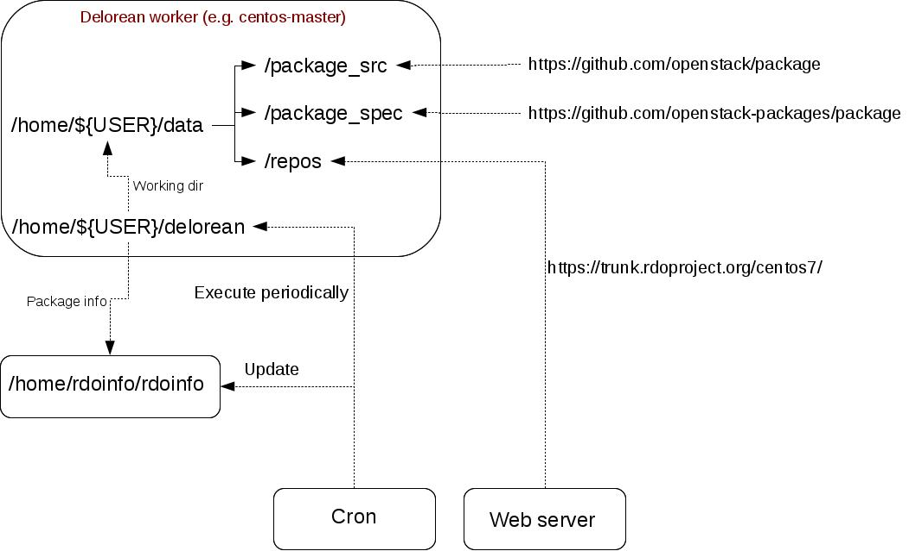

Introduction
------------

This document describes the Delorean infrastructure: how it is configured, what it does, and how you can replicate it if needed.

For information on Delorean as a software package, refer to [the Delorean page](https://github.com/openstack-packages/delorean).

### Authors and changelog

- Javier Peña (jpena@redhat.com) commited the initial version.

Delorean infrastructure overview
--------------------------------
### Delorean components

The Delorean infrastructure on an instance contains the following components:

- A number of `workers`. A worker is basically a local user, with a local Deloran checkout from the GitHub repo, and some associated configuration:
  - `/usr/local/share/delorean/${USER}/projects.ini` with the Deloran instance configuration
  - `/home/${USER}/data/repos/delorean-deps.repo` contains the YUM/DNF repositories hosting all dependencies for the specific OpenStack release.
  - A crontab entry, which periodically triggers the `delorean` execution for the worker.

- An `rdoinfo` user. This user simply hosts a local checkout of the [rdoinfo repository](https://github.com/redhat-openstack/rdoinfo), which is refreshed periodically using a crontab entry.

- A web server to host the generated repos. A number of symlinks from `/var/www/html` into the worker's home directories are created, for example `/var/www/html/f22` will link to `/home/fedora-master/data/repos`.

### Delorean instance

A single instance (or VM) can perform all the tasks at the moment.

### High availability

To achieve high availability, we set up two Delorean instances in separate cloud providers, defining a *primary* and a *secondary* Delorean instance. We use `lsyncd` to make sure all Delorean data is synchronized between the instances.

The secondary instance has some components stopped:

- The `lsyncd` daemon, since it is receiving updates from the primary instance.
- The `crontab` entries that start the different Delorean workers.

If the primary instance fails, the following manual steps need to be taken to switch to the secondary instance:

- Switch the DNS entry for trunk.rdoproject.org
- Enable the `crontab` entries for the Delorean workers.

Once the primary instance is back, make sure you synchronize all data before switching DNS entries.

Deploying a Delorean instance
-----------------------------

### Pre-requisites
The files included in this repo provide all the necessary bits to deploy a Delorean instance:

- create-delorean.sh is a shell script that connects to an OpenStack deployment, creates a 160 GB Cinder volume and associates it to a new instance, which is deployed using `delorean-user-data.txt` as user-data file.
- delorean-user-data.txt contains all the installation and configuration steps, in cloud-init [cloud-config format](http://cloudinit.readthedocs.org/en/latest/topics/format.html#cloud-config-data).

There are a few important topics to keep in mind:

- You will probably need to adjust `create-delorean-sh` to your environment, specially if you want to deploy the Delorean instance on a different cloud provider.
- The `delorean-user-data.txt` file is bigger than 16 KB, which causes issues for some providers, such as Amazon EC2. This configuration will be puppetized in the future.

About the hardware requirements, they are not that big:

- 2 CPUs, 4 GB of RAM (the more, the merrier)
- 160 GB volume for /home, where the Delorean workers are located

You will need to define a security group with the following open ports:

- 22  (SSH)
- 80  (HTTP)
- 443 (HTTPS)
- 3300 (optional, to relocate sshd)

### Instance deployment
If deploying to an OpenStack instance, make sure you have sourced the configuration script and just run:

    ./create-delorean.sh

### Manual post-installation steps
Not everything can be deployed automatically. Currently, there are some steps that require manual intervention post-deployment:

1. sh.py needs to be patched on all venvs, according to the information provided in https://github.com/amoffat/sh/pull/237
2. To use https, you will need a properly singed SSL certificate. File `/root/README_SSL.txt` contains the information on which files need to be placed in the file system, and how to run the script that will configure it.
3. The `lsyncd` daemon configuration file, `/etc/lsyncd.conf` needs to be modified to include the IP address of the secondary system. Once that is done, start the `lsyncd` service. Please *do not* enable the service to run on startup. If you do so, during a failover scenario it can overwrite anything in the currently working Delorean instance.
4. The crontab entries for the workers are commented out by default. Uncomment them to begin processing packages.
5. Remove port 22 from the security group, if you want to reduce the number of automated brute-force attacks against `sshd`.
